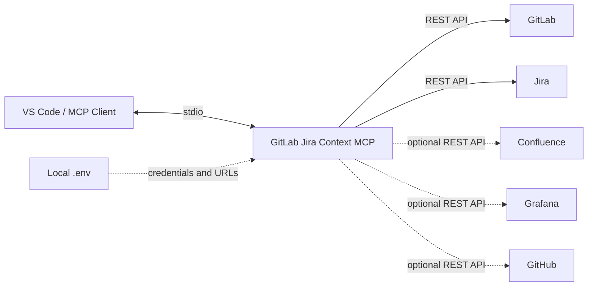

# GitLab Jira Context MCP

[](https://www.typescriptlang.org/)
[](https://nodejs.org/)
[](https://modelcontextprotocol.io/)
[](https://about.gitlab.com/)
[](https://www.atlassian.com/software/jira)
[](https://grafana.com/)
[](https://github.com/)

A local Model Context Protocol (MCP) server that connects GitLab project and merge-request context with Jira work tracking, Confluence pages, Grafana dashboards, and optional GitHub repository context. Jira comments, worklogs, and GitHub file changes require explicit confirmation.

The server uses stdio and runs on your machine. It sends requests only to the service URLs that you configure locally.

## Architecture



The server never exposes an HTTP endpoint or persists service data. Tokens stay in your local `.env` file or process environment.

## Included Tools

| Tool | Description |
| --- | --- |
| `gitlab_list_projects` | List projects visible to the configured GitLab token. |
| `gitlab_get_project` | Get a project by ID or path. |
| `gitlab_list_merge_requests` | List merge requests, optionally for one project. |
| `gitlab_get_merge_request` | Get a merge request and its metadata. |
| `gitlab_list_pipelines` | List recent CI/CD pipelines for a project. |
| `gitlab_get_file` | Get a repository file at a branch, tag, or commit. |
| `jira_get_my_issues` | List issues assigned to the authenticated Jira user. |
| `jira_get_issue` | Get an issue by key, including comments. |
| `jira_search_issues` | Search issues with JQL. |
| `jira_get_transitions` | List workflow transitions available for an issue. |
| `jira_get_changelog` | Get issue status and field history. |
| `jira_list_comments` | List comments on an issue with `startAt` pagination. |
| `jira_list_worklogs` | List worklog entries on an issue with `startAt` pagination. |
| `jira_add_comment` | Add a comment after passing `confirm: true`. |
| `jira_add_worklog` | Add a worklog entry after passing `confirm: true`. |
| `confluence_get_page` | Get a Confluence page and its stored content. |
| `confluence_search` | Search Confluence content with CQL. |
| `grafana_search_dashboards` | Search dashboards visible to the configured service account. |
| `grafana_get_dashboard` | Get a Grafana dashboard by UID. |
| `github_get_authenticated_user` | Verify access for the configured GitHub token. |
| `github_list_repositories` | List repositories visible to the configured token. |
| `github_get_repository` | Get repository metadata by owner/name. |
| `github_get_file_content` | Read one repository file at a branch or ref. |
| `github_create_or_update_file` | Create or update one UTF-8 text file after passing `confirm: true`. |

GitLab, Confluence, Grafana, and GitHub read tools are read-only. Jira mutations and GitHub file writes require an explicit `confirm: true` input and use the permissions of the configured token.

Jira search, comments, and worklogs return the service's pagination metadata. When `total` exceeds the number of returned entries, call the same tool with a later `startAt` value. `jira_add_worklog` accepts Jira duration syntax such as `1h 30m` and an optional ISO 8601 `started` timestamp.

## Repository Structure

```text
gitlab-jira-context-mcp/
├── src/
│   ├── client.ts       # HTTP clients, authentication, and request helpers
│   └── server.ts       # MCP tool registration and input schemas
├── test/
│   └── client.test.ts  # Focused helper and request-payload tests
├── .env.example        # Neutral local configuration template
├── package.json        # Scripts and dependencies
└── tsconfig.json       # TypeScript configuration
```

## Requirements

- Node.js 20 or newer
- An MCP client with stdio server support, such as Visual Studio Code with GitHub Copilot
- A GitLab personal access token with access to the projects you need
- A Jira Server or Data Center personal access token
- Optional: a Confluence Server or Data Center personal access token
- Optional: a Grafana service account token with dashboard read access
- Optional: a GitHub fine-grained personal access token; repository metadata and file reads need read access, while `github_create_or_update_file` needs repository contents write access

## Quick Start

1. Clone the repository and install dependencies.

   ```bash
   git clone https://github.com/jagarkarlo/gitlab-jira-context-mcp.git
   cd gitlab-jira-context-mcp
   npm install
   npm test
   npm run build
   ```

2. Create your local configuration.

   ```bash
   cp .env.example .env
   ```

    Set `GITLAB_BASE_URL`, `GITLAB_TOKEN`, `JIRA_BASE_URL`, and `JIRA_API_TOKEN`. Confluence and Grafana are optional; set both variables in either integration's pair to enable its tools. Set `GITHUB_TOKEN` to enable GitHub tools; `GITHUB_API_BASE_URL` is optional for GitHub Enterprise Server. Keep `.env` local; it is ignored by Git.

3. Register the compiled server in your MCP client. In VS Code, run `MCP: Open User Configuration` and add this entry to the `servers` object. Replace `/absolute/path/to` with the cloned repository path.

   ```json
   {
     "servers": {
       "gitlab-jira-context": {
         "type": "stdio",
         "command": "node",
         "args": [
           "/absolute/path/to/gitlab-jira-context-mcp/dist/server.js"
         ]
       }
     }
   }
   ```

4. Restart the server from `MCP: List Servers` or reload VS Code.

## Security

- The server reads credentials only from the local `.env` file or process environment.
- Use tokens with the smallest access scope that supports your intended requests.
- Review the configured service URLs before starting the server.
- Do not place credentials in source files, MCP configuration, issue comments, or commits.
- Verify the issue key, work duration, and content before setting `confirm: true` for a Jira write.
- Use a fine-grained GitHub token scoped only to the repositories and contents permissions you need.
- Read the existing file with `github_get_file_content` and pass its returned SHA when updating a GitHub file.

## Configuration Boundaries

| Integration | Required | Access |
| --- | --- | --- |
| GitLab | Yes | Read-only projects, merge requests, pipelines, and repository files. |
| Jira | Yes | Read issues, comments, worklogs, transitions, and changelog; confirmed comment/worklog writes. |
| Confluence | Optional | Read-only page lookup and CQL search. |
| Grafana | Optional | Read-only dashboard search and retrieval. |
| GitHub | Optional | Read authenticated-user, repository, and file context; confirmed single-file UTF-8 writes. |

## Development

Run the checks before committing changes:

```bash
npm test
npm run build
git diff --check
```

`src/client.ts` contains the HTTP and response-handling helpers. `src/server.ts` registers the MCP tools and their input schemas. Tests cover the shared client helpers; add focused tests when changing behavior.

## Roadmap

Future releases can add GitLab merge-request discussions and project search, while retaining explicit confirmation for every write operation.

## License

This project is licensed under the [MIT License](LICENSE).
